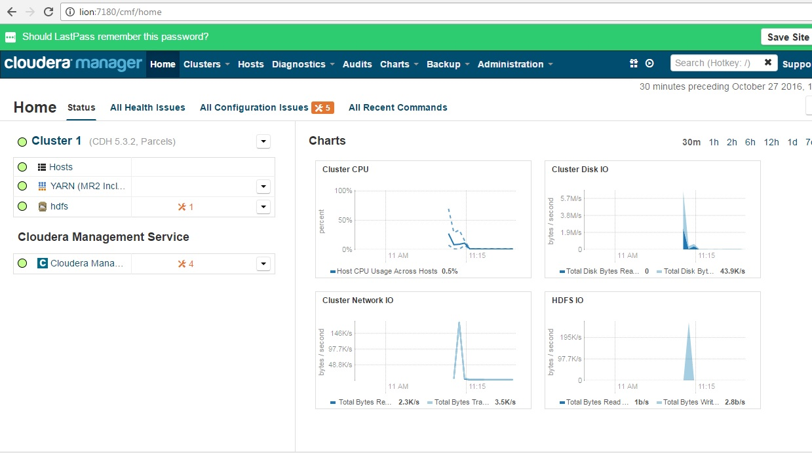

# Cloudera Labs Setup (0-60 in 20 seconds)

This uses terraform to setup a 5-node cluster for CDH5.1.

### Before you Begin
Have you used AWS CLI before? If you have, you may safely ignore this bit. If not, read on:
* *Get an AWS account.* Don't use a production account.  
  This lab is 6x t.medium instances, `estimated at 40p hr with typical lab use.`
  **Ask permission from the person who pays the bills** 

1) [Installing the AWS CLI](http://docs.aws.amazon.com/cli/latest/userguide/installing.html)  
2) [Sign Up for Amazon Web Services](http://docs.aws.amazon.com/cli/latest/userguide/cli-chap-getting-set-up.html#cli-signup)  
3) [Configuring the AWS CLI](http://docs.aws.amazon.com/cli/latest/userguide/cli-chap-getting-started.html)
4) [Creating Your Key Pair Using Amazon EC2 via Console](http://docs.aws.amazon.com/AWSEC2/latest/UserGuide/ec2-key-pairs.html#having-ec2-create-your-key-pair), or [create-key-pair](http://docs.aws.amazon.com/cli/latest/reference/ec2/create-key-pair.html), or [ssh-keygen](https://www.digitalocean.com/community/tutorials/how-to-set-up-ssh-keys--2)(don't overwrite your current one)  
5) [Importing Your Own Key Pair to Amazon EC2](http://docs.aws.amazon.com/AWSEC2/latest/UserGuide/ec2-key-pairs.html#how-to-generate-your-own-key-and-import-it-to-aws)
`NB: chmod 400 ./terraform/tempaltes/cloudera_training.key`

### Set up Terraform

* Install [AWS SDK CLI](http://docs.aws.amazon.com/cli/latest/userguide/installing.html)
* This method required installation of [Terraform](https://www.terraform.io/intro/getting-started/install.html) on your PC.
* You need to know your [public ip](http://icanhazip.com/). You EC2 instance will be reachable only from this locaiton.
* Edit `terraform\EDITME.tf` and set your **public-source ip**, **ssh-key in AWS** and **local ssh-key file**.

### Create the EC2 instances
This will be super fast.

     $ cd terraform
     james@localhost:terraform$ terraform apply
     <wait 5 mins>
     james@localhost:terraform$ cd ../tools
     james@localhost:tools$ ./get_hostnames.rb

After 5 minutes, the script will complete (ignore the following error)**
    
`Error applying plan:`  

`6 error(s) occurred:`  

`* ssh: handshake failed: ssh: unable to authenticate, attempted methods [none publickey], no supported methods remain`  
`* ssh: handshake failed: ssh: unable to authenticate, attempted methods [none publickey], no supported methods remain`  
`* ssh: handshake failed: ssh: unable to authenticate, attempted methods [none publickey], no supported methods remain`  
`* ssh: handshake failed: ssh: unable to authenticate, attempted methods [none publickey], no supported methods remain`  
`* ssh: handshake failed: ssh: unable to authenticate, attempted methods [none publickey], no supported methods remain`  
`* ssh: handshake failed: ssh: unable to authenticate, attempted methods [none publickey], no supported methods remain`  

`Terraform does not automatically rollback in the face of errors.` 
`Instead, your Terraform state file has been partially updated with`  
`any resources that successfully completed. Please address the error` 
`above and apply again to incrementally change your infrastructure.`  
`jamesliu:terraform$`

### Configure
1) Edit your /etc/hosts entries to match the *public ip addresses* output of the `get_hostnames.rb` script

        james@localhost:tools$ sudo vi /etc/hosts

2) Connect to *elephant* and run `CM_configure_host.sh`, and plug in the *private ip addresses*.

        james@localhost:tools$ ssh -i ../terraform/templates/cloudera_training.key training@elephant
        training@elephant:~$ CM_config_hosts.sh 

3) Install CDH to your desired stage in your lab (the scripts may take 5-20 mins to complete)  

        training@elephant:~$ ~/training_materials/admin/scripts/reset_cluster.sh

4) Connect to http://lion:7180  
   (credentials) admin/admin

     
### REMEMBER TO CLEANUP
Remember that these instances cost money.
**Clean up after yourself.**

     $ cd terraform
     james@localhost:terraform$ terraform destroy
